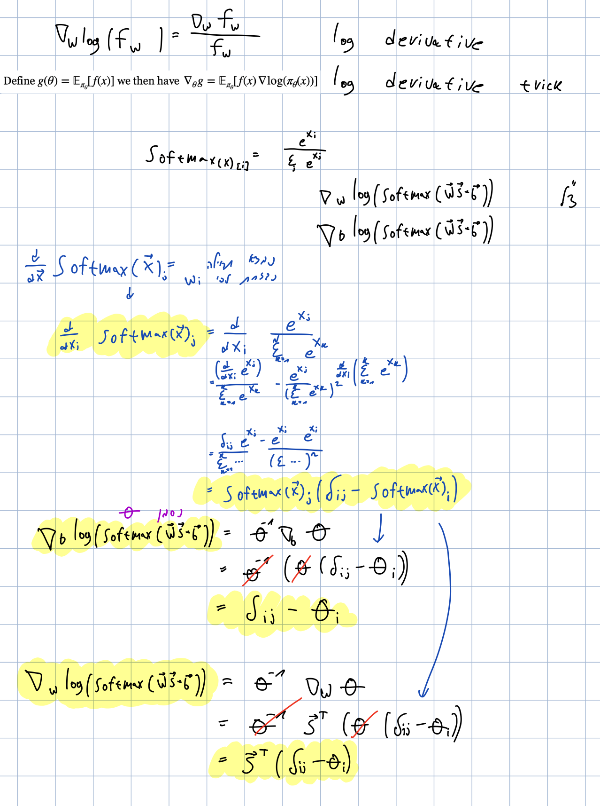

# Programming Assignment 2

## Yuval Saraf

### Questions

1. Done, check file [PGAgent.py](src/PGAgent.py#L28).
2. Here are the calculations
   
   Code here [PGAgent.py](src/PGAgent.py#L42).
3. Done, check file [train.py](src/train.py#L32).
4. Done, check file [train.py](src/train.py#L32).
5. Done, check file [train.py](src/train.py#L58).
6. For running agent with different parameters I constructed this [script](mixed-runs.sh), in the next question will show the results as requested.
7. Running agent for different results
   - `b=1 (N=10000), RTG=False, baseline=False`
     ```bash
     Average training rewards:  85.0219
     _________________________
     Running 500 test episodes....
     Test reward 85.0±1.4
     ```
   - `b=1 (N=10000), RTG=False, baseline=True`
     ```bash
     Average training rewards:  83.3562
     _________________________
     Running 500 test episodes....
     Test reward 83.9±1.4
     ```
   - `b=1 (N=10000), RTG=True, baseline=False`
     ```bash
     Average training rewards:  85.2891
     _________________________
     Running 500 test episodes....
     Test reward 85.1±1.5
     ```
   - `b=1 (N=10000), RTG=True, baseline=True`
     ```bash
     Average training rewards:  85.5463
     _________________________
     Running 500 test episodes....
     Test reward 86.4±1.5
     ```
   - `b=5 (N=2000), RTG=False, baseline=False`
     ```bash
     Average training rewards:  85.8076
     _________________________
     Running 500 test episodes....
     Test reward 85.2±1.5
     ```
   - `b=5 (N=2000), RTG=False, baseline=True`
     ```bash
     Average training rewards:  64.1358
     _________________________
     Running 500 test episodes....
     Test reward 65.9±0.9
     ```
   - `b=5 (N=2000), RTG=True, baseline=False`
     ```bash
     Average training rewards:  85.6378
     _________________________
     Running 500 test episodes....
     Test reward 86.7±1.5
     ```
   - `b=5 (N=2000), RTG=True, baseline=True`
     ```bash
     Average training rewards:  85.4221
     _________________________
     Running 500 test episodes....
     Test reward 85.5±1.3
     ```
